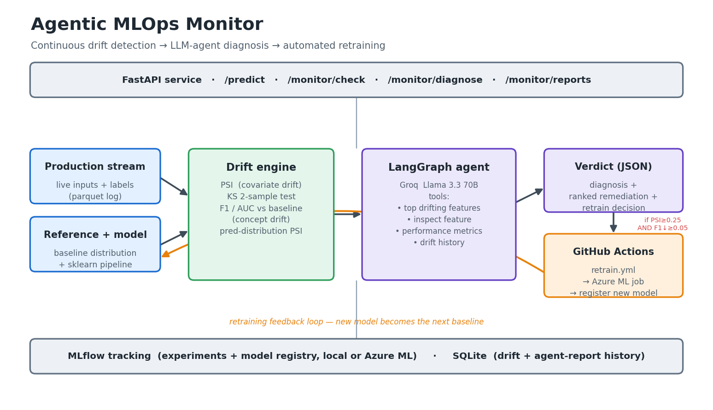
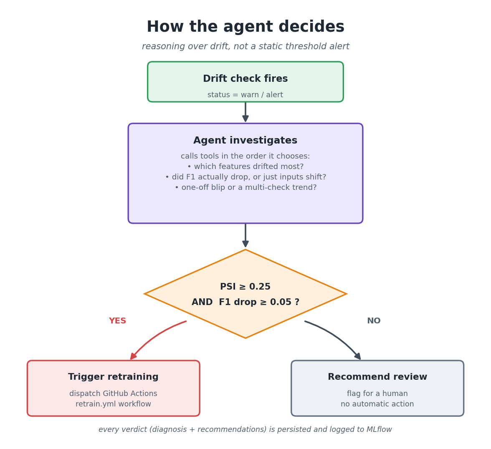

# Agentic MLOps Monitor

An agentic AI system that continuously monitors a production ML model, detects **data drift** and **concept drift**, and uses an **LLM agent (LangChain + LangGraph)** to produce natural-language diagnostic reports and remediation recommendations. When drift thresholds are breached, the agent dispatches a **GitHub Actions** retraining pipeline. All experiments and model versions are tracked with **MLflow**, with the same code path deployable to **Azure ML**.

**Stack:** Python · FastAPI · scikit-learn · MLflow · LangChain · LangGraph · Groq (free LLM API) · Azure ML · Docker · GitHub Actions

> **Why this exists and how it actually works** → read [STORY.md](STORY.md) for the narrative version (why ML models silently degrade, what the agent actually does, and the design choices behind it).

---

## Architecture



The full pipeline: production + reference data feed the drift engine (PSI, KS, F1/AUC vs baseline); a LangGraph agent investigates the results and emits a verdict; breaching thresholds dispatches a GitHub Actions retraining job whose new model becomes the next baseline. FastAPI serves it; MLflow and SQLite track everything.

### How the agent decides



The agent doesn't just alert on a threshold — it uses tools to investigate whether the drift actually matters, and only triggers retraining when **both** data drift (`PSI ≥ 0.25`) **and** performance degradation (`F1 drop ≥ 0.05`) are present. Otherwise it recommends a human review.

---

## Quick start (local)

```powershell
# 1. Install
python -m venv .venv
.\.venv\Scripts\Activate.ps1
pip install -r requirements.txt

# 2. Configure
copy .env.example .env
# Edit .env and set GROQ_API_KEY (free at https://console.groq.com)

# 3. Train the baseline model + log to MLflow
$env:PYTHONPATH = "src"
python scripts/train_baseline.py

# 4. Seed the "production" log with clean + drifted batches
python scripts/seed_production.py --clean 3000 --drifted 1500 --mode both

# 5. Run one drift-check + agent pass
python scripts/run_monitor.py --window-hours 168

# 6. Or run the FastAPI service
uvicorn mlmonitor.main:app --reload
# → http://localhost:8000/docs
```

## Quick start (Docker)

```bash
docker compose up --build
# API:        http://localhost:8000/docs
# MLflow UI:  http://localhost:5000
```

After the API is up:

```bash
curl -X POST http://localhost:8000/train/baseline
curl -X POST http://localhost:8000/simulate/batch \
  -H "content-type: application/json" \
  -d '{"n": 1500, "drift_mode": "both", "intensity": 1.2}'
curl -X POST http://localhost:8000/monitor/check \
  -H "content-type: application/json" \
  -d '{"window_hours": 168, "run_agent": true}'
```

---

## What the agent actually does

When `/monitor/check` runs and the status is `warn` or `alert`, the LangGraph ReAct agent is invoked with the drift summary. It then:

1. Calls `get_top_drifting_features` to identify which features shifted most.
2. Calls `inspect_feature` for each suspicious feature to compare ref vs prod means/stds.
3. Calls `get_performance_metrics` to confirm whether F1 has actually dropped.
4. Optionally calls `get_recent_drift_history` to check whether this is a one-off or a trend.
5. Calls `trigger_retraining` **only when both** `psi_max >= 0.25` **and** `f1_drop >= 0.05`.
6. Emits a structured JSON verdict: `{ diagnosis, recommendations[], trigger_retraining }`.

That tool-using loop is what makes it an agent rather than a one-shot LLM call.

---

## Drift detection methods

| Method                          | Detects             | Where                                              |
| ------------------------------- | ------------------- | -------------------------------------------------- |
| PSI (Population Stability Index)| Covariate drift     | `src/mlmonitor/drift/data_drift.py`               |
| KS two-sample test              | Distributional drift| `src/mlmonitor/drift/data_drift.py`               |
| F1 / AUC vs baseline            | Concept drift       | `src/mlmonitor/drift/concept_drift.py`            |
| Prediction-distribution PSI     | Label-free proxy    | `src/mlmonitor/drift/concept_drift.py`            |

Thresholds (configurable via `.env`):
- `PSI_WARN_THRESHOLD` = 0.10
- `PSI_ALERT_THRESHOLD` = 0.25
- `PERF_DROP_ALERT` = 0.05
- `MIN_SAMPLES_FOR_CHECK` = 100 (windows smaller than this return `insufficient_data` instead of unreliable stats)

---

## Measured detection performance

The detectors are benchmarked end-to-end (same code path the live monitor runs) over 30 simulated
production batches per scenario — see [eval/RESULTS.md](eval/RESULTS.md), regenerable with
`PYTHONPATH=src python scripts/evaluate_drift.py`:

| Scenario | Data-drift detection | Concept-drift detection | False alarms |
|----------|---------------------|------------------------|--------------|
| Clean traffic | — | — | **0%** |
| Covariate shift (moderate, 0.5×) | **100%** | 20% | — |
| Covariate shift (strong, 1.0×) | **100%** | 100% | — |
| Concept drift only (strong) | 0% (by design: features unchanged) | **97%** | — |
| Both (moderate) | **100%** | **100%** | — |

The concept-only row is the interesting one: labels shift while feature distributions stay identical
(PSI ≈ 0.008), so PSI/KS see nothing — and the F1-drop detector still catches 97%. That's why the
system runs both detectors rather than relying on data drift as a proxy.

CI re-runs this evaluation on every push and uploads the results as a build artifact.

---

## Observability

- **`GET /dashboard`** — live HTML dashboard: latest status, PSI trend sparkline, recent checks, and agent verdicts. Auto-refreshes; zero build step.
- **`GET /metrics`** — Prometheus exposition: prediction counts, drift checks by status, agent run outcomes, retrain dispatches, last PSI/F1 gauges, and check-duration histogram. Point any Prometheus/Grafana at it.
- Structured logs via `LOG_LEVEL` (default `INFO`).

---

## Azure ML deployment

The `azure/` directory contains job, environment, endpoint, deployment, and schedule manifests. With an Azure ML workspace:

```bash
az login
az account set --subscription <SUB_ID>

# 1. One-off retraining job
az ml job create -f azure/train-job.yml -g <RG> -w <WS>

# 2. Hourly scheduled drift check
az ml schedule create -f azure/schedule.yml -g <RG> -w <WS>

# 3. Online endpoint + blue deployment (FastAPI as managed inference)
az ml online-endpoint create -f azure/endpoint.yml -g <RG> -w <WS>
az ml online-deployment create -f azure/deployment.yml -g <RG> -w <WS> --all-traffic
```

When `MLFLOW_TRACKING_URI` is set to the Azure ML workspace tracking URI, all runs (training + drift checks) appear in the Azure ML studio Jobs view.

---

## CI/CD

- **`.github/workflows/ci.yml`** — `ruff` lint, `pytest` with a 70% coverage gate, the drift-detection evaluation (results uploaded as artifact), and a Docker build on every push/PR.
- **`.github/workflows/retrain.yml`** — `workflow_dispatch` triggered by the LangChain agent. Trains the baseline, runs tests, and (if Azure credentials are present) submits an Azure ML training job.

The agent dispatches the workflow via the GitHub REST API using a fine-grained PAT (set `GITHUB_OWNER`, `GITHUB_REPO`, `GITHUB_TOKEN` in `.env`).

---

## Project layout

```
src/mlmonitor/
  config.py              # pydantic-settings, reads .env
  main.py                # FastAPI app
  monitor.py             # end-to-end orchestration (drift → agent → persist)
  models/train.py        # baseline trainer + reference data generator
  drift/data_drift.py    # PSI + KS
  drift/concept_drift.py # F1 drop + prediction-distribution PSI
  agent/monitor_agent.py # LangGraph ReAct agent + tools
  agent/prompts.py       # system + initial prompts
  mlflow_utils/tracking.py
  simulator/production_stream.py
  storage/db.py          # SQLite via SQLAlchemy
  observability.py       # Prometheus counters/gauges/histograms
  dashboard.py           # single-file HTML dashboard (GET /dashboard)
  logging_utils.py       # shared logging setup
scripts/                 # CLI entry points + evaluate_drift.py benchmark
eval/                    # measured detection rates (RESULTS.md + results.json)
azure/                   # Azure ML manifests
.github/workflows/       # CI (lint + tests + eval + docker) + retrain
tests/                   # 31 tests: drift math, simulator, monitor, API, agent parsing, storage
```

---

## Tests

```powershell
$env:PYTHONPATH = "src"
pytest tests -q          # 31 tests, all offline — no API key needed
ruff check src tests scripts
```

The suite covers the drift statistics, the simulator (including a regression test for a
distribution-mismatch bug the evaluation harness caught), the end-to-end API flow
(train → predict → simulate → check), agent output parsing, and the metrics store.
